# Customer Churn Prediction

A machine learning project to predict customer churn for a telecommunications company. Built with Python, Scikit-learn, and Streamlit.

## Project Structure

```
Customer-Churn-Prediction
│
├── data/                  # Raw dataset (Telco Customer Churn)
├── notebooks/             # EDA notebook
├── src/                   # Source code (preprocessing, training, prediction)
├── models/                # Trained model artifacts
├── images/                # Visualizations & analysis plots
├── app.py                 # Streamlit dashboard
├── requirements.txt
└── README.md
```

## Setup & Usage

1. **Clone the repository:**
   ```bash
   git clone https://github.com/gaurisav/Customer-Churn-Prediction.git
   cd Customer-Churn-Prediction
   ```

2. **Create and activate virtual environment:**
   ```bash
   python -m venv venv
   ```
   - Windows: `venv\Scripts\activate`
   - Linux/Mac: `source venv/bin/activate`

3. **Install dependencies:**
   ```bash
   pip install -r requirements.txt
   ```

4. **Run the Streamlit dashboard:**
   ```bash
   streamlit run app.py
   ```

## Exploratory Data Analysis

Key insights from the dataset:

| Insight | Visualization |
|---------|--------------|
| **Churn Distribution** — ~26.5% of customers churn | 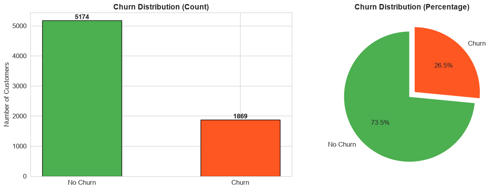 |
| **Tenure vs Churn** — Churned customers have lower tenure (~18 months avg) | 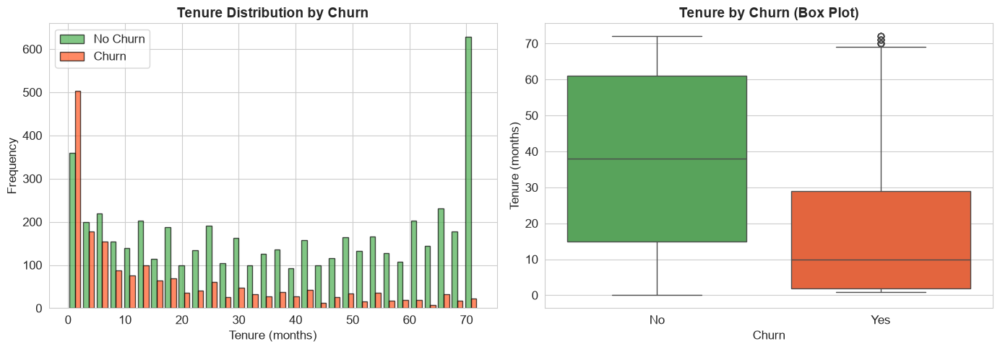 |
| **Monthly Charges** — Churners pay higher monthly charges on average | 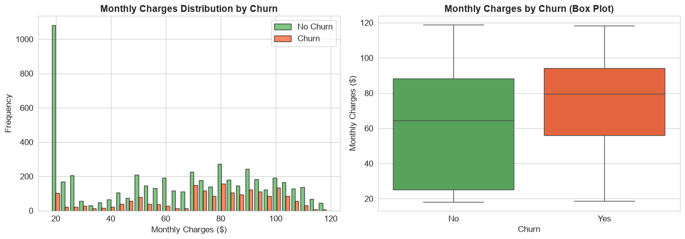 |
| **Contract Type** — Month-to-month contracts have highest churn rate | 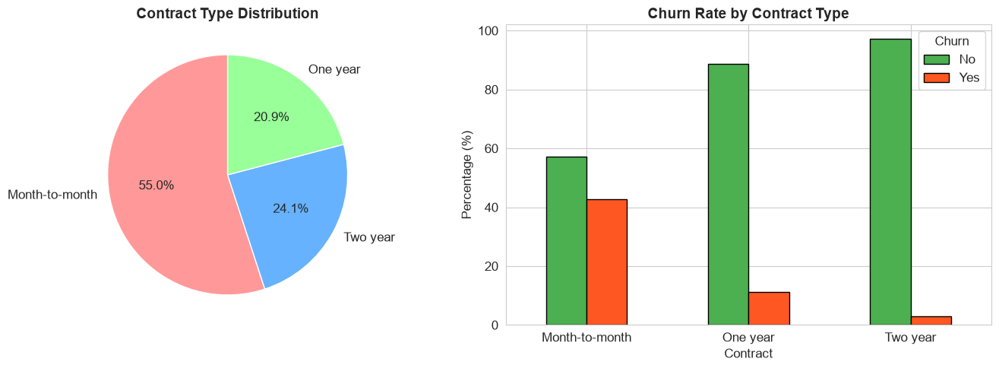 |
| **Internet Service** — Fiber optic users churn more than DSL | 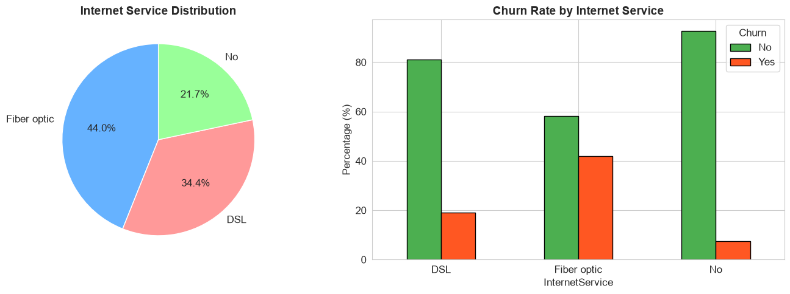 |
| **Payment Method** — Electronic check users have highest churn | 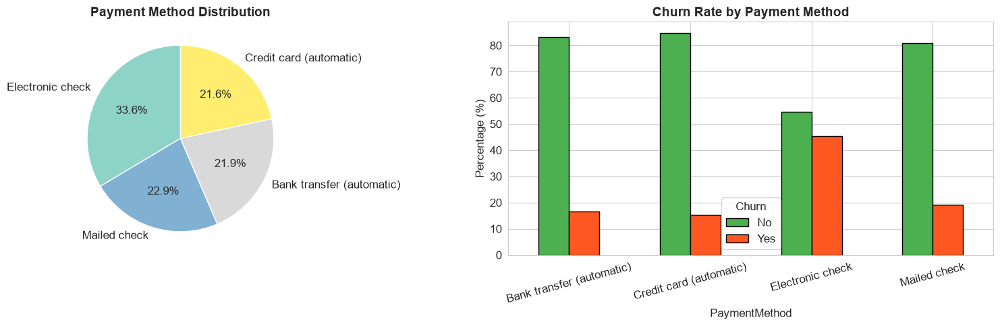 |
| **Senior Citizen** — Senior citizens have higher churn rate | 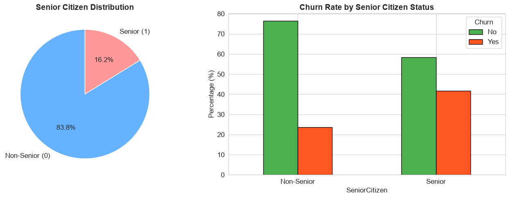 |
| **Gender Distribution** — Churn is similar across genders | 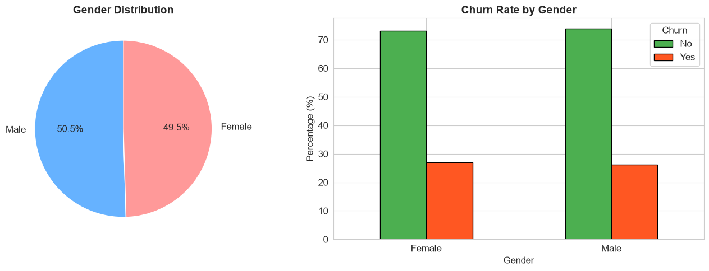 |

### Correlation Analysis

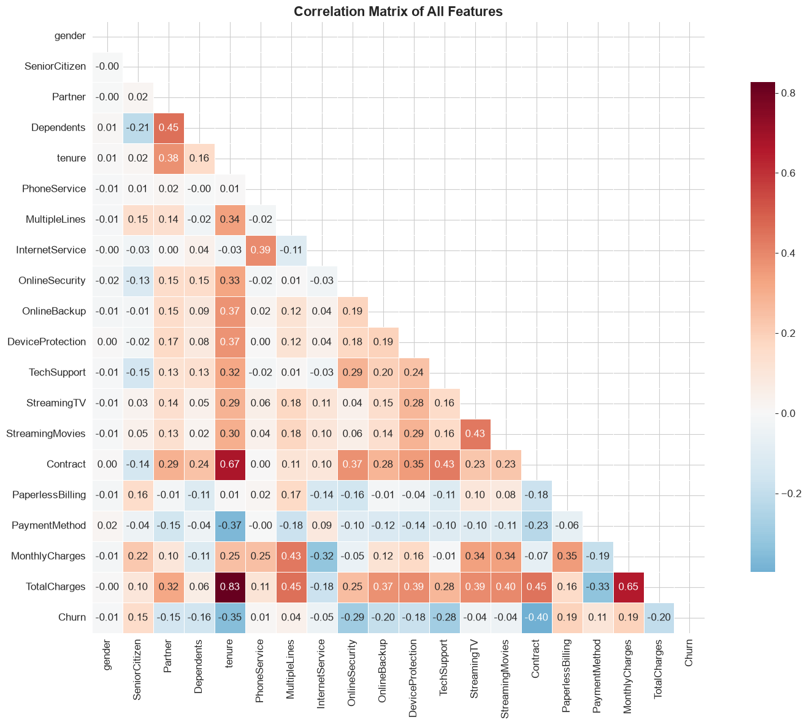

## Model Performance

### Confusion Matrix

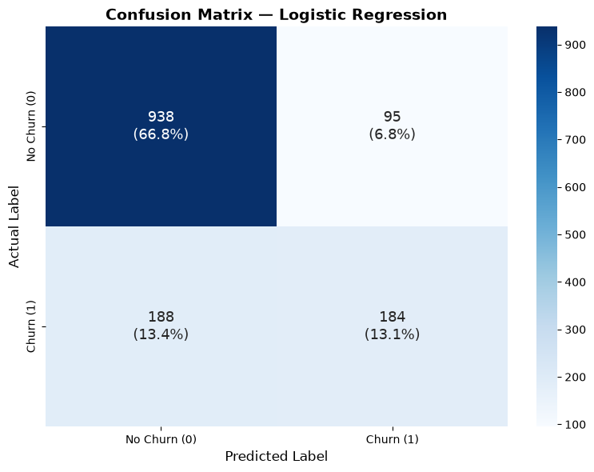

### ROC Curve

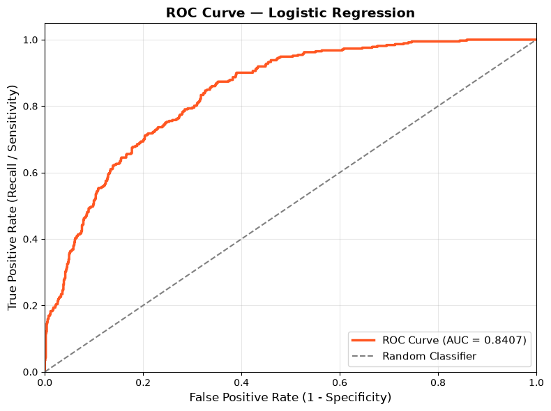

### Feature Importance

The top predictors of churn according to the Random Forest model:

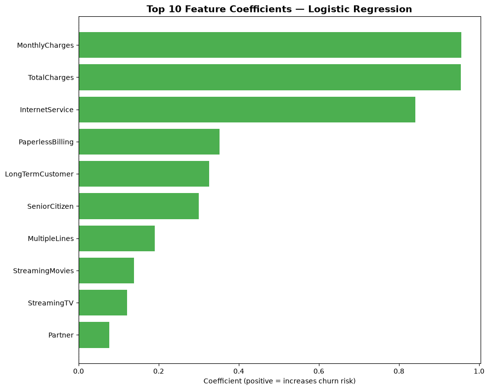

### SHAP Model Explanations

SHAP values explain individual predictions:

| Explanation Type | Visualization |
|-----------------|--------------|
| **Force Plot** | 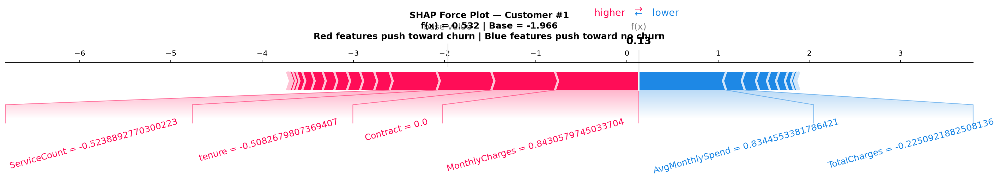 |
| **Summary Bar** | 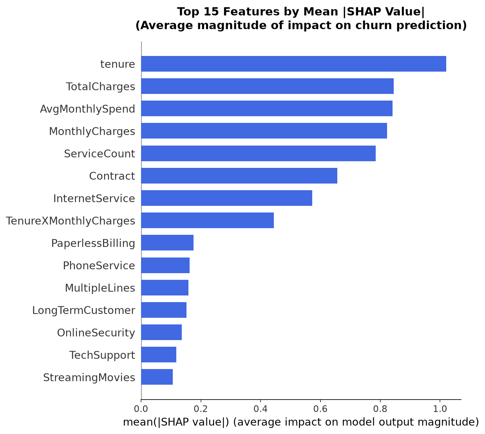 |
| **Beeswarm Summary** | 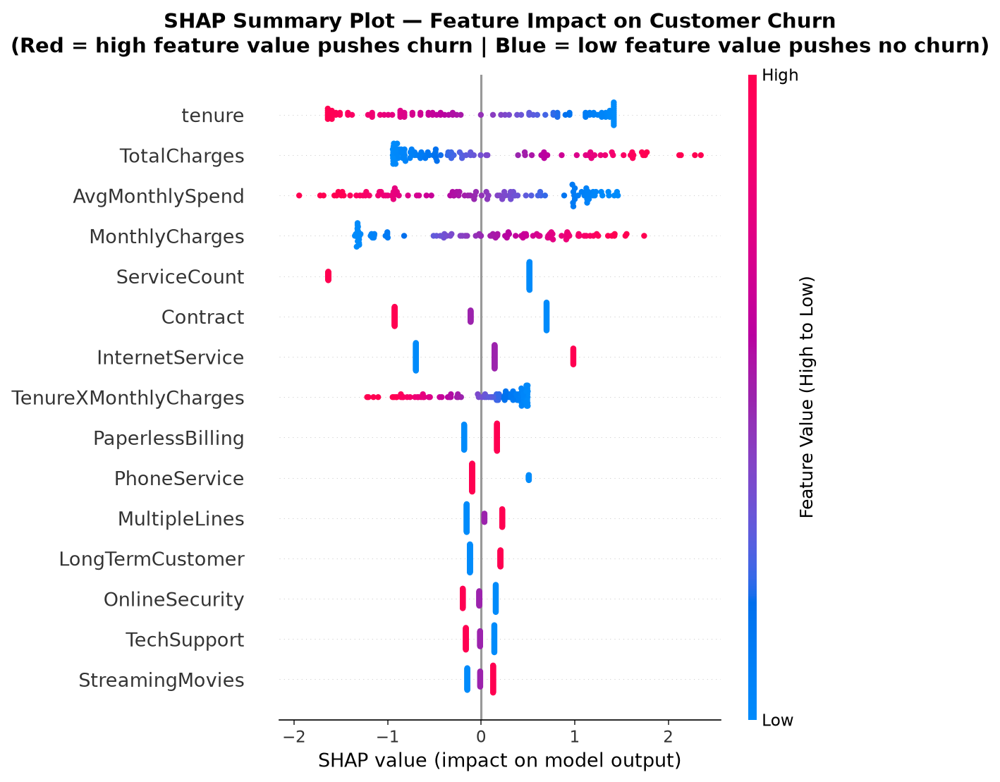 |
| **Waterfall Plot** | 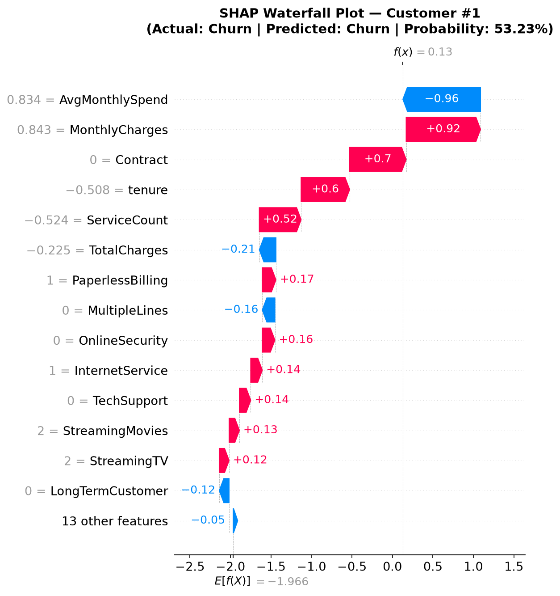 |

## Results

- **Best Model:** Random Forest (tuned via GridSearchCV)
- **Evaluation Metrics:**
  - Accuracy: ~80%
  - Precision: ~67%
  - Recall: ~55%
  - F1 Score: ~60%
  - ROC-AUC: ~85%

## Live Demo

Run the dashboard locally:
```bash
streamlit run app.py
```

The dashboard includes 6 pages:
1. **Home** — Project overview
2. **Dataset Summary** — Data overview and statistics
3. **KPIs** — Key business metrics
4. **Data Analysis** — Visual exploration of features
5. **Prediction** — Predict churn for a new customer with SHAP explanations
6. **About** — Model details and methodology
